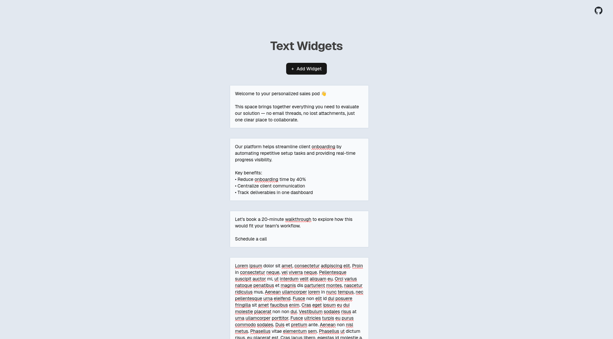

# Trumpet Technical Challenge

A simple app where users can add, edit, and persist multiple text widgets. Built with Next.js.



## Tech Stack

- Next.js 15 (App Router)
- TypeScript
- Jest + React Testing Library
- In-memory backend storage

## Setup

```bash
npm install
npm run dev
```

Then open http://localhost:3000

## Run Tests

```bash
npm test
```

## (Optional) Run with Docker

```bash
docker build -t text-widgets .
docker run -p 3000:3000 text-widgets
```

## Notes

- Text widgets automatically adjust their height to fit large strings of text, thanks to [`react-textarea-autosize`](https://www.npmjs.com/package/react-textarea-autosize)
- I added a note indicating to the user that changes will be saved automatically. This changes to a "Saving..." indicator when the app makes a request to update the text widget after a debounce timeout. This note is only visible when a text widget is focused to minimize distractions.
- Likewise, the delete button is only visible when the text widget is focused or hovered.

## Trade-offs and Design Decisions

- Widgets are stored in memory instead of a database for speed and simplicity. This avoids setup complexity but means data resets when the server restarts.
- I've implemented client-side debounce autosaves after 500ms instead of requiring the user to press a "Save" button. This improves UX and prevents unsaved data from being lost, but causes a bunch of PUT requests for the smallest changes.
- No authentication, which means all widgets are global. In a real world app, widgets would be scoped per user or per pod.
- I used a simple array to store the widgets instead of a hashmap -- the latter might be more performant, but in a simple app like this, that would be premature optimization.

## Continued development

If I had more time, these are the stuff I would focus on:

- Improving UI/UX by adding better empty and loading states
- Adding a confirmation dialog to prevent users from accidentally deleting text widgets
- Integrating a lightweight database like MongoDB to persist data across server restarts
- Implement optimistic updates, so there's minimal lag between the user clicking the "Add widget" button and the new widget appearing on screen
- Show network or server errors with toast notifications so the user knows when the app isn't working
- Improve accessibility especially for screen readers
